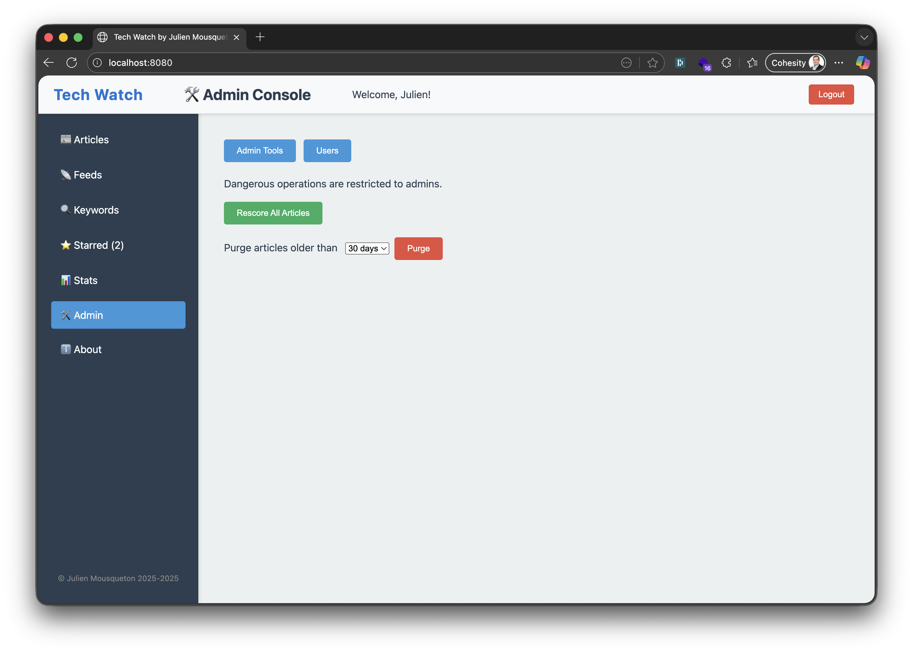
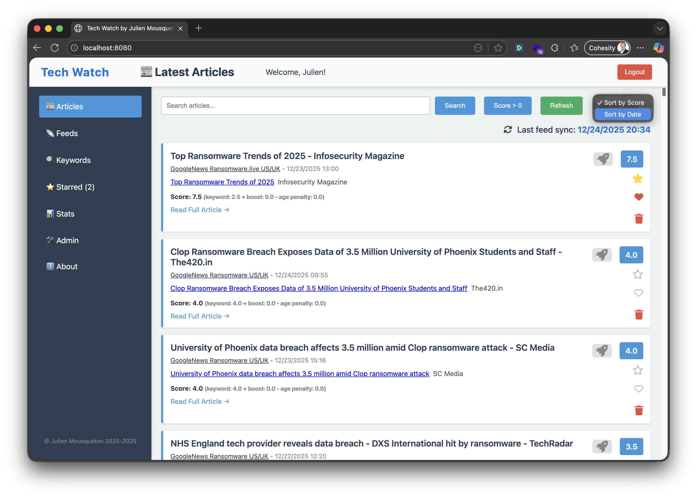
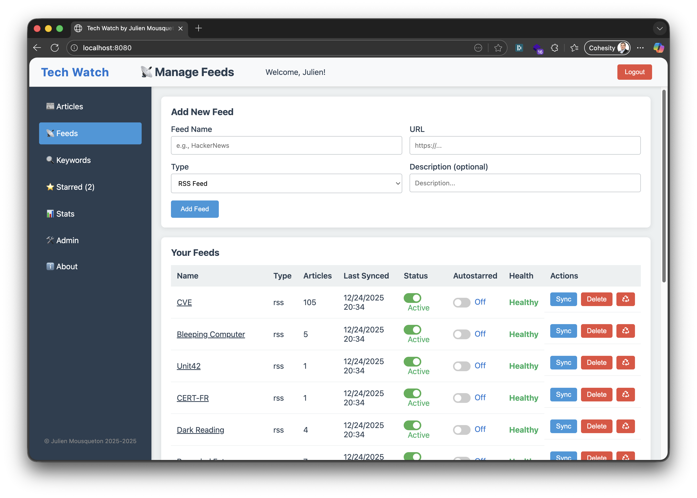
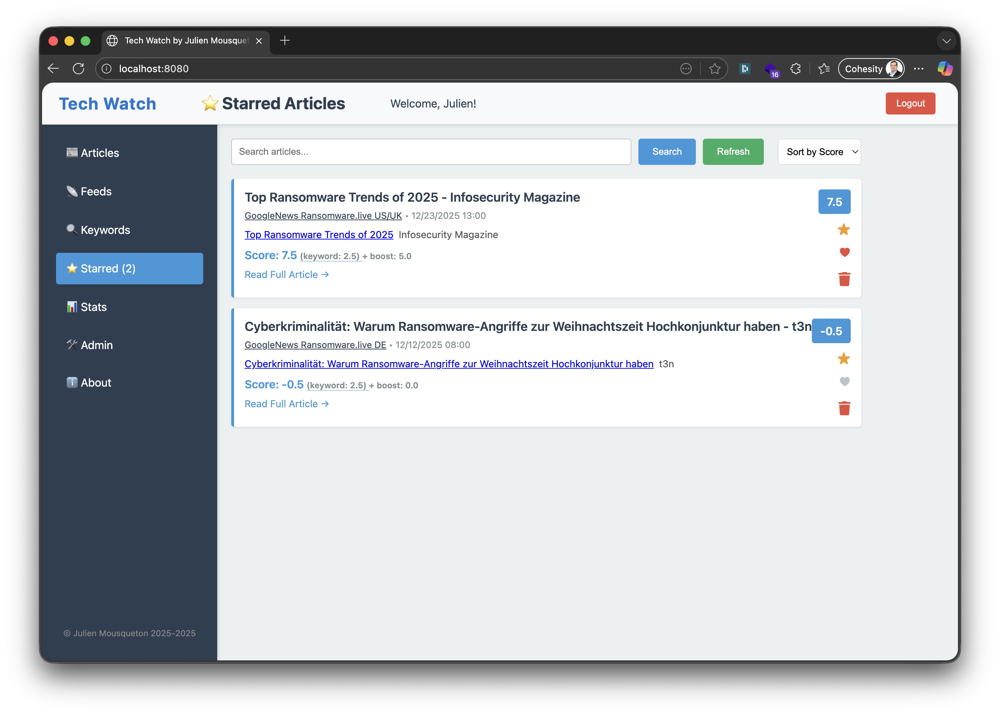

# Tech Watch

A Python/FastAPI web application for technology watch with RSS reading, web scraping, and intelligent article scoring based on keywords.

## Screenshots

Below are screenshots of the main features and pages:

| Admin Page | Articles | Feeds | Keywords | Starred |
|:---:|:---:|:---:|:---:|:---:|
|  |  |  |  |  |


## Features

- **Authentication & Security**: User registration, login, JWT tokens, and secure endpoints.
- **Feed Management**: Add/manage RSS feeds, Google News feeds (with region/language support), and web scrapers. Recycle feeds and view feed health.
- **Google News Feed Generator**: Easily generate and add Google News RSS feeds by specifying keywords and selecting a country (France, UK, Germany, Canada, USA). The app automatically formats the correct region/language parameters for Google News.
- **Keyword Scoring**: Configure keywords with custom weights; automatic scoring of articles based on matches.
- **Article Management**: View, search (with boolean/advanced queries), like (♥), star (⭐), delete, and filter articles. Dedicated Starred page with backend filtering. Share articles on social media (LinkedIn, X, Bluesky) via a modal popup.
- **Scoring System**: Base score from keywords, +5 boost for likes, total score used for sorting and display.
- **UI/UX**: Responsive Vue.js frontend, flexbox sidebar, popups, tooltips, and modern design. Live icon color updates for likes/stars. Rocket icon with share modal (LinkedIn, X, Bluesky).
- **Statistics & Trends**: Stats page with top keywords, article/feed/keyword counts, and most-read articles.
- **Admin Tools & User Management**: Rescore all articles, purge old articles (safe by age), color-coded admin actions, and full user management (list, create, update, delete users; admin toggles).
- **Autostarred Feeds**: Option to autostar all new articles from selected feeds.
- **Maintenance & Health**: Visual indicators for feed health, last sync, and quick maintenance actions.
- **Dynamic Starred Count**: Starred (xx) count in the menu updates live on every click.
- **API & Database**: RESTful API, SQLite backend, full-text search, and robust schema for users, feeds, keywords, articles, and interactions.

## Project Structure

```
techwatch/
├── backend/
│   ├── app/
│   │   ├── models/          # SQLAlchemy models
│   │   ├── schemas/         # Pydantic request/response schemas
│   │   ├── routes/          # API endpoints
│   │   ├── services/        # Business logic
│   │   ├── scrapers/        # RSS reader and web scraper
│   │   └── utils/           # Helper functions
│   ├── main.py              # FastAPI application
│   └── requirements.txt      # Python dependencies
├── frontend/
│   ├── index.html           # HTML entry point
│   └── static/
│       ├── css/style.css    # Styling
│       └── js/app.js        # Vue.js application
└── README.md
```


## Setup

### Docker (Recommended)

1. **Build and run with Docker Compose**:
   ```bash
   cd docker
   docker compose up --build
   ```

   - Backend API: http://localhost:8001
   - Frontend: http://localhost:8080
   - API docs: http://localhost:8001/docs
   - ReDoc docs: http://localhost:8001/redoc

2. **Configuration**:
   - Edit `backend/.env` for backend settings (see below)
   - The Docker setup uses `docker/backend.Dockerfile` and `docker/frontend.Dockerfile`.

---

### Manual (Dev) Setup

#### Backend

1. **Install dependencies**:
   ```bash
   cd backend
   pip install -r requirements.txt
   ```

2. **Configure environment**:
   ```bash
   cp .env.example .env
   # Edit .env with your settings
   ```

3. **Run the server**:
   ```bash
   python main.py
   ```

   The API will be available at `http://localhost:8001`
   - API docs: `http://localhost:8001/docs`
   - ReDoc docs: `http://localhost:8001/redoc`

#### Frontend

1. **Serve the frontend**:
   ```bash
   cd frontend
   python -m http.server 8080
   # or use any simple HTTP server
   ```

   Access at `http://localhost:8080`


## Usage

### 1. Register and Login
- Create a new account with username, email, and password
- Login to get a JWT token

### 2. Configure Keywords
- Go to "Keywords" section
- Add keywords you want to monitor (e.g., "AI", "Machine Learning")
- Set weight for each keyword (1.0 = +1 point per match, 2.0 = +2 points, etc.)

### 3. Add Feeds
- Go to "Feeds" section
- To add a standard feed: Enter the RSS feed URL (e.g., https://news.ycombinator.com/rss) or a web scraper URL.
- To add a Google News feed: Use the "Add Google News Feed" form. Enter a name, keywords (comma or space separated), and select a country (France, UK, Germany, Canada, USA). The app will generate the correct Google News RSS URL for you.
- Click "Sync" to fetch articles (only new articles since last sync are added)
-
#### Google News Feed Generator Example

1. Go to the "Feeds" page.
2. In the "Add Google News Feed" section, enter:
   - **Name**: Any label for your feed (e.g., "Google News AI FR")
   - **Keywords**: e.g., `AI, Machine Learning`
   - **Country**: Select from France, UK, Germany, Canada, USA
3. The app will generate a Google News RSS URL like:
   - For France: `https://news.google.com/rss/search?q="AI+Machine+Learning"&hl=fr&gl=FR&ceid=FR:fr`
   - For UK: `https://news.google.com/rss/search?q="AI+Machine+Learning"&hl=en-GB&gl=GB&ceid=GB:en`
   - For Germany: `https://news.google.com/rss/search?q="AI+Machine+Learning"&hl=de-DE&gl=DE&ceid=DE:de`
   - For Canada: `https://news.google.com/rss/search?q="AI+Machine+Learning"&hl=en-CA&gl=CA&ceid=CA:en`
   - For USA: `https://news.google.com/rss/search?q="AI+Machine+Learning"&hl=en-US&gl=US&ceid=US:en`
4. The keywords are automatically wrapped in double quotes and joined with `+` for Google News compatibility.
5. Click "Add Google News Feed" to save it. The feed will appear in your list and can be synced like any other feed.

### 4. Browse and Interact
- View articles sorted by score (keyword matches + user interactions)
- Click the ⭐ to bookmark articles
- Click the ♥ to like articles (+5 points boost)
- Click the 🗑️ to delete articles
- Search articles by keywords
- View article details and read full content

### 5. Admin Tools
- Use the admin page to rescore all articles or purge old articles

## API Endpoints

### Authentication
- `POST /api/auth/register` - Register new user
- `POST /api/auth/login` - Login user
- `POST /api/auth/refresh` - Refresh token

### Feeds
- `GET /api/feeds` - List user's feeds
- `POST /api/feeds` - Create new feed
- `PUT /api/feeds/{id}` - Update feed
- `DELETE /api/feeds/{id}` - Delete feed
- `POST /api/feeds/{id}/sync` - Sync feed (fetch new articles)

### Keywords
- `GET /api/keywords` - List user's keywords
- `POST /api/keywords` - Create keyword
- `PUT /api/keywords/{id}` - Update keyword
- `DELETE /api/keywords/{id}` - Delete keyword


### Articles
- `GET /api/articles` - List articles with scores
- `GET /api/articles/search?query=...` - Search articles
- `GET /api/articles/{id}` - Get article details
- `POST /api/articles/{id}/like` - Like article
- `POST /api/articles/{id}/unlike` - Unlike article
- `POST /api/articles/{id}/star` - Star article
- `POST /api/articles/{id}/unstar` - Unstar article
- `DELETE /api/articles/{id}` - Delete article

### Maintenance (Admin)
- `POST /api/maintenance/rescore/` - Recalculate all article scores
- `POST /api/maintenance/purge/?days=N` - Purge articles older than N days

## Database

SQLite database with the following tables:
- `users` - User accounts
- `feeds` - RSS feeds and web scrapers
- `keywords` - User's keywords
- `articles` - Scraped articles
- `article_keywords` - Keyword matches in articles
- `user_article_interactions` - Likes, stars, read status


## Configuration

Edit `backend/.env`:
- `DATABASE_URL` - SQLite database path
- `SECRET_KEY` - JWT secret (change in production!)
- `CORS_ORIGINS` - Allowed frontend URLs (e.g., ["http://localhost:3000", "http://localhost:5173", "http://localhost:8001"])
- `ACCESS_TOKEN_EXPIRE_MINUTES` - Token expiration time

## Technologies

- **Backend**: FastAPI, SQLAlchemy, SQLite
- **Frontend**: Vue.js 3, Vanilla JavaScript
- **Scraping**: BeautifulSoup4, feedparser
- **Authentication**: PyJWT, bcrypt
- **Database**: SQLite with full-text search support
